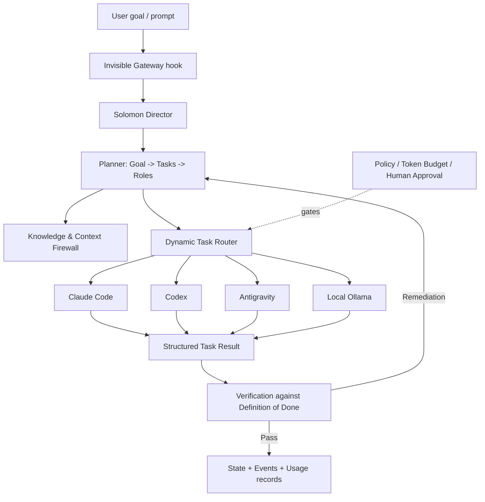

<p align="center">
  
</p>

<p align="center">
  <em>Orchestrating AI, Knowledge, and You for a More Capable Tomorrow.</em>
</p>

<p align="center">
  <strong>v0.4.0-alpha</strong> &middot; Alpha pre-release &middot; MIT License
</p>

> [!WARNING]
> **This is an Alpha release.** It is an early, research-stage project,
> not production software. Architecture, CLI flags, and data schemas may
> change without a deprecation period before v1.0.0. Please read
> [Known limitations](#known-limitations) before relying on it.

# Solomon AI Orchestrator

Solomon is a local-first AI orchestration layer for routing, context
management, safety, evaluation, and coordinated AI workflows.

You keep working in your normal AI interface (Claude Code, Codex, ...);
a gateway can suggest delegating suitable requests to Solomon in the
background. Solomon reconstructs project context, decomposes the goal
into tasks, routes each task to a suitable available AI agent, checks
the result against a Definition of Done, records evidence, and returns
the integrated result to the original caller.

Solomon is **not** an AI-to-AI chat system. The default communication
mode between agents is structured task/result contracts, not free-form
dialogue. A bounded, opt-in Debate Mode exists for a small set of
high-value design decisions only.

## Why Solomon exists

Using several AI tools on the same projects tends to scatter context,
duplicate token spend, and blur who did what and whether it actually
worked. Solomon puts one explicit layer in front of those tools so that
routing decisions, project context, usage, approvals, and verification
results live in one local, inspectable place -- instead of in each
tool's separate chat history.

## Core principles

- **Invisible orchestration** -- no need to explicitly "call Solomon".
- **Role != Agent** -- roles (Implementer, Reviewer, Tester, ...) are
  selected first; which AI provider fills that role is decided
  dynamically, based on recorded historical performance and current
  availability.
- **Agent output is evidence, not completion** -- a task only reaches
  COMPLETE after Solomon checks it against a Definition of Done, never
  from an agent's own claim.
- **Safety above autonomy** -- policy and human-approval gates cannot be
  overridden by an agent, an addon, or a lower autonomy setting.
- **Token & Compute Intelligence, not cost accounting** -- Solomon's core
  usage model is tokens and compute; pricing/currency is explicitly out
  of Core's required scope.
- **Local-first, privacy-first** -- telemetry is off by default, and
  diagnostics exports are redacted by default.
- **Durable and observable** -- every meaningful action is an event;
  state survives interruption and can be reconciled/resumed.

## Capabilities in v0.4.0-alpha

- **Environment & capability discovery** -- detects which AI CLIs and
  local models are available (`solomon discover`).
- **Runtime foundation** -- Goal/Task model, policy engine, SQLite
  event/state store, Definition of Done verification.
- **Invisible Gateway** -- an advisory-only `UserPromptSubmit` hook
  (`hooks/`) that can suggest delegation; it never blocks a prompt.
- **Knowledge & Context Firewall** -- project-scoped, relevance-ranked,
  deduplicated, secret-redacted context retrieval with project
  isolation.
- **Multi-provider routing & execution** -- adapters for Claude Code,
  Codex, Antigravity, and local Ollama; history-informed routing with
  fallback and GPU-aware penalties for local models.
- **Extensions** -- addon manifest discovery/validation and a read-only
  MCP server (`python -m solomon.mcp_server`).
- **Token & Compute Intelligence** -- structured `UsageRecord`s with
  explicit provenance, multi-scope Token Budgets with a Human Approval
  hard stop, Context Savings / Token Efficiency metrics, and
  token-pressure-aware routing.
- **Reliability & evaluation** -- recovery and crash-window handling,
  replay and router comparison, and a categorized eval runner
  (`solomon eval`).
- **UX & inspection** -- plain-text dashboard, usage/approval views, and
  privacy-aware diagnostics export.

## Architecture (high level)



The full design is in `docs/specification/02_Architecture/`.

## Safety model

Solomon favors explicit boundaries over unrestricted autonomous
execution:

- **Policy and approval gates** -- risk-classified tasks can require
  explicit human approval (`solomon approvals`), and a Token Budget
  hard stop always goes through Human Approval.
- **Project isolation** -- context retrieval is scoped per project;
  cross-project leakage is covered by dedicated tests.
- **Redaction by default** -- diagnostics and log exports redact
  secrets; more detail is opt-in and still secret-redacted.
- **No third-party code execution** -- addons are validated but not
  executed in this release (see below).
- **Advisory gateway** -- the prompt hook only suggests delegation; it
  cannot block or rewrite your prompt.

These mechanisms reduce risk; they do not make the system secure
against a determined attacker. See `SECURITY.md` for reporting issues.

## Known limitations

This Alpha is implemented and covered by an automated regression suite,
but some areas are intentionally thin or deferred. These are documented
scope limits, not bugs:

- Addon **execution** (`ENABLED` state) is not implemented -- addon
  manifests are discovered and validated only, because no sufficiently
  safe process-isolation mechanism has been established.
- A Jev (Decision Intelligence) adapter does not exist yet; the data
  model that would record its usage is in place and unused.
- GPU/local-compute telemetry is a live snapshot and is not reliably
  attributable to individual completed tasks.
- The dashboard is a plain-text, periodically-refreshing CLI view, not a
  curses-based interactive TUI (deliberate, for portability).
- `route-and-run` does not currently go through the same risk-based
  Human Approval gate that `run-task` does.

See `CHANGELOG.md` for the full list of what is in this release.

## Future direction

Areas under consideration after v0.4 (not commitments):

- A safe process-isolation model that would allow addon execution.
- A Jev Decision Intelligence adapter.
- Per-task attribution of local GPU/compute usage.
- Aligning `route-and-run` with the `run-task` approval gate.
- Stabilizing CLI flags and schemas on the way to v1.0.

## Requirements

- Python 3.11+
- See `requirements.txt` for Python dependencies (`pyyaml`, `mcp`).
- At least one supported AI CLI adapter available on your machine
  (Claude Code, Codex, Antigravity, or a local Ollama install) --
  Solomon orchestrates existing tools, it doesn't replace them.

## Getting started

```bash
# Editable install -- registers the `solomon` command and pulls in
# pyyaml/mcp per pyproject.toml.
pip install -e .

# Copy the example configs and fill in your own values -- the real
# files are gitignored (they hold your local project paths).
cp 04_Config_Schemas/projects.registry.example.yaml 04_Config_Schemas/projects.registry.yaml
cp 03_Policies/GLOBAL_POLICY.example.yaml 03_Policies/GLOBAL_POLICY.yaml

# List CLI subcommands
solomon --help
```

(No `pip install -e .` yet, or don't want one? `PYTHONPATH=src python -m
solomon.cli --help` works the same way without installing anything.)

A few commands to try once you've registered a project:

```bash
solomon project-list
solomon route --role coder --project-id your_project
solomon dashboard --project-id your_project
solomon diagnostics-export --project-id your_project
```

`solomon --help` lists every subcommand (routing, execution, approvals,
worktree-isolated parallel runs, usage/budget inspection, replay, router
comparison, the categorized eval runner, and more).

## Running the test suite

```bash
pip install -e ".[dev]"
pytest -q
```

## Documentation

- `docs/specification/01_Specification/` -- the normative behavior spec.
- `docs/specification/02_Architecture/` -- runtime topology and
  component design.
- `docs/specification/03_Gateway_Runtime/`,
  `docs/specification/04_Addon_SDK/`,
  `docs/specification/05_Logging_Project_Layout/` -- subsystem
  contracts.
- `docs/specification/07_Schemas/` -- JSON Schemas for `UsageRecord`,
  events, and tasks.
- `docs/specification/10_Roadmap/` -- the phased roadmap this release
  implements.
- `03_Policies/`, `04_Config_Schemas/` -- policy and config schema, with
  `.example.yaml` templates for anything that holds local paths.
- `CHANGELOG.md` -- what's in this release.

## Contributing

See `CONTRIBUTING.md`. Please read `SECURITY.md` before reporting a
security-relevant issue.

## License

MIT -- see `LICENSE`.
